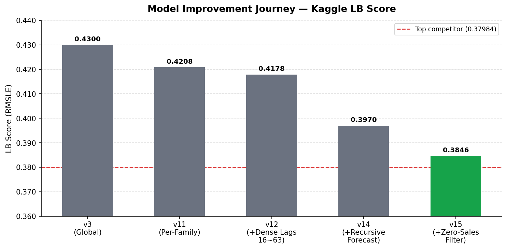
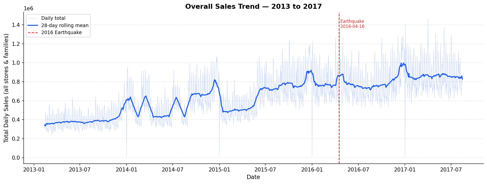
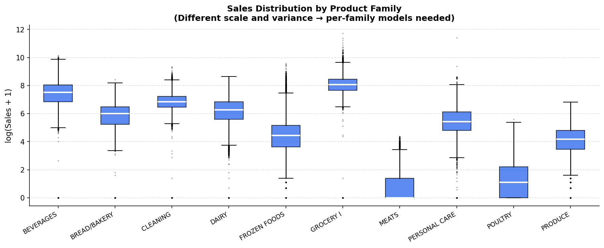
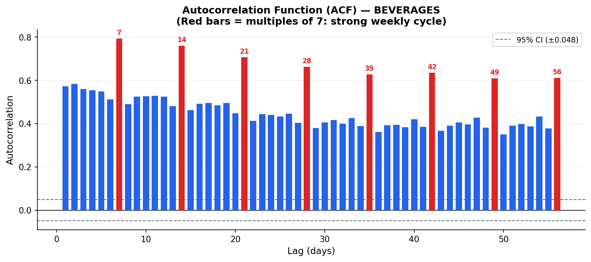
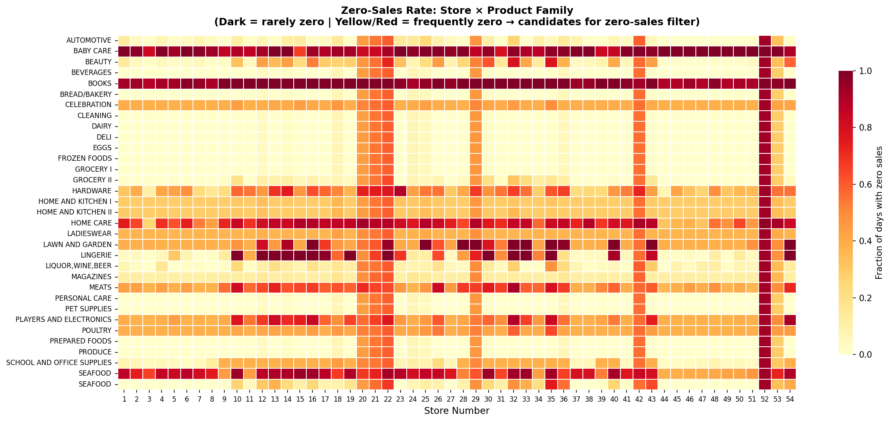
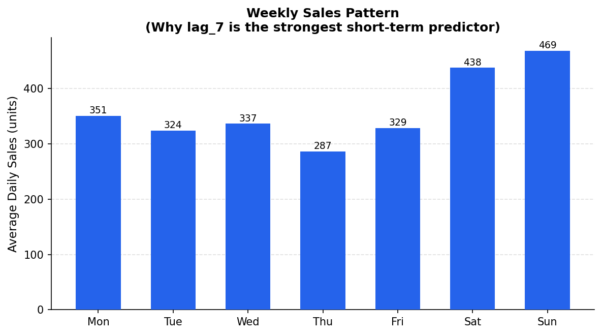

# Store Sales Forecasting — Corporación Favorita

Kaggle competition: [Store Sales - Time Series Forecasting](https://www.kaggle.com/competitions/store-sales-time-series-forecasting)

**Task:** Forecast daily sales for 54 stores × 33 product families (1,782 time series) across 16 days (Aug 16–31, 2017) for a large Ecuadorian grocery chain.

**Metric:** RMSLE (Root Mean Squared Logarithmic Error) — lower is better.

---

## Results



| Version | Architecture | Key Change | LB Score |
|---------|-------------|------------|----------|
| v3 | Global LightGBM | Baseline with full feature engineering | 0.430 |
| v11 | Per-Family (33 models) | Independent model per product category | 0.42084 |
| v12 | Per-Family + Dense Lags | Consecutive lags lag_16~63 | 0.41781 |
| v14 | Per-Family + Recursive | Recursive forecasting with lag_1~63 | 0.397 |
| **v15** | Per-Family + Recursive + Zero-Sales | Post-processing for discontinued series | **0.38465** |

Total improvement over baseline: **~11%**

---

## Data Overview



The dataset spans Feb 2013 to Aug 2017. The April 2016 earthquake caused a visible disruption to purchasing patterns, handled via an explicit dummy variable. Overall sales show a gradual upward trend with strong weekly and annual seasonality.

---

## Methodology

### 1. Feature Engineering (`02_feature_engineering.py`)

- **Lag features:** Sales on previous days (lag_1 to lag_63, lag_364/371/728)
- **Rolling statistics:** 7/14/28-day rolling mean and std
- **Calendar features:** Day of week, month, week of year, is_weekend, is_month_start, is_end_of_month
- **Holiday features:** National / regional / local holiday flags, days_to_holiday, days_after_holiday (matched by store geography)
- **Oil price:** Daily price + 7/28-day moving average (Ecuador's economy is oil-dependent)
- **Promotion:** onpromotion flag + lagged and rolling versions
- **Earthquake dummy:** 2016/4/16 caused prolonged disruption to purchasing behavior

### 2. Per-Family Models (`14_per_family.py`, `15_per_family_dense_lags.py`)

Replaced a single global model with **33 independent LightGBM models**, one per product family.



**Why it works:** The box plots above reveal that PRODUCE, BEVERAGES, and MEATS have fundamentally different sales distributions — different scale, variance, and skew. A global model forces one tree structure to approximate all of them simultaneously; per-family models let each learn its own patterns.

**Dense consecutive lags (lag_16~63):** Instead of sparse handcrafted lag points (lag_16, lag_21, lag_28...), providing all 48 consecutive lags lets the model implicitly learn any moving average pattern — trends, momentum, mean reversion — without manual feature engineering.

### 3. Recursive Forecasting (`17_recursive_forecast.py`)

The forecast horizon is 16 days (Aug 16–31). Direct forecasting forces a minimum lag of 16 days. **Recursive forecasting** predicts one day at a time:

```
Predict Aug 16 → store in buffer
Predict Aug 17 using Aug 16 prediction as lag_1
Predict Aug 18 using Aug 17 prediction as lag_1, Aug 16 as lag_2
...
```

This unlocks **lag_7** (weekly cycle), the strongest short-term predictor. The ACF plot below shows why:



The autocorrelation spikes sharply at lag 7, 14, 21, 28 — consumer shopping behavior follows a strong weekly rhythm. Making lag_7 available as a feature (via recursive prediction) was the single largest improvement, dropping LB from 0.41781 to 0.397.

**Trade-off:** Prediction errors accumulate over the horizon. Days 14–16 carry more noise than days 1–3. In production, confidence intervals widen significantly toward the end of the forecast window.

### 4. Zero-Sales Post-Processing (`18_zero_sales_postprocess.py`, `19_zero_window_search.py`)

If a store–family combination had **zero sales for the past 3–7 days**, force predictions to 0.



The heatmap reveals that certain families (BOOKS, BABY CARE, MAGAZINES) have high zero-sale rates in many stores — these are low-velocity SKUs that are either intermittent or regionally stocked. Models always output small positive numbers for these series, but the correct forecast is 0. Zeroing them out corrects a systematic positive bias.

Tested windows from 1 to 35 days; **w=3–7 days** performed best (LB 0.38465).

---

## Key Findings & Real-World Insights

### 1. Weekly cycles dominate short-term demand



Sales are consistently highest on **weekends and Fridays**, lowest on Tuesdays. This weekly rhythm is the dominant short-term signal — stronger than any calendar or promotion feature. `lag_7` was the top feature in every per-family model.

**In production: ensure your data pipeline delivers T-1 day sales with <24h latency** so short-lag features are always available for daily retraining.

### 2. Product category matters more than store location

Splitting by family (product category) gave larger gains than any store-level segmentation. Demand patterns are shaped more by *what* is being sold than *where* it is sold. **Recommendation: build category-level forecasting pipelines rather than one-size-fits-all models.**

### 3. Zero-sales detection is an inventory signal, not just a modeling fix

The 127 store–family combinations with 7+ consecutive zero-sale days represent either discontinued SKUs, stockouts, or seasonal gaps. **Recommendation: automatically flag these for store manager review.** If stockout — trigger replenishment. If discontinued — cancel pending purchase orders.

### 4. Year-ago signals are useful but fragile

lag_364/371 (same period last year) captures annual seasonality. However, restricting the training window to 2015+ (to emphasize recent data) *hurt* performance — reducing sample size outweighed the freshness benefit. **Recommendation: use full historical data with year-ago lag features rather than truncating the training window.**

### 5. Macroeconomic context belongs in retail models

Oil price was a consistently non-trivial feature. Ecuador's government revenue is oil-dependent, affecting public employee wages (a large consumer segment) with a 1–3 month lag. **For international deployment: identify the local macro indicator most correlated with consumer spending** (e.g., fuel price, unemployment rate, consumer confidence index) and include it as a feature.

### 6. Holiday effects require geographic precision

National holidays lift all stores uniformly. Regional and local holidays affect only stores in the corresponding state/city. Mismatching holiday features to store location introduces noise and can cause the model to *discount* real holiday effects. **Recommendation: maintain a store–geography mapping and apply holiday features at the correct granularity.**

### 7. Structural breaks need explicit handling

The April 2016 earthquake caused a ~3-week disruption to normal purchasing patterns. Without an explicit dummy variable, the model treats this as seasonal noise and may learn incorrect lag patterns from that period. **Recommendation: maintain a "disruption calendar" for known structural breaks** (natural disasters, strikes, pandemic periods, supply chain crises) and add indicator variables.

---

## Real-World Deployment Recommendations

| Area | Recommendation |
|------|----------------|
| **Data latency** | Daily sales data with <24h lag is required to use lag_1~7 features |
| **Retraining cadence** | Weekly retraining recommended; monthly is minimum given strong weekly cycles |
| **Inventory** | Auto-flag store–SKU with 7+ zero-sales days for manager review |
| **Promotions** | Forward-looking `onpromotion` calendar (known in advance) is a high-value feature — maintain it rigorously |
| **Model granularity** | Per-category models; consider per-store-type if store count is small |
| **Forecast horizon** | Confidence degrades after day 7 in recursive mode; for 14+ day horizons, widen safety stock buffers accordingly |
| **Macro features** | Include local macro indicator relevant to consumer purchasing power |

---

## Repository Structure

```
├── 01_eda.py                      # Exploratory data analysis
├── 02_feature_engineering.py      # Feature pipeline → outputs/train_fe.parquet
├── 08_model_v3.py                 # Global LightGBM baseline (v3, LB 0.430)
├── 14_per_family.py               # Per-family architecture (v11, LB 0.42084)
├── 15_per_family_dense_lags.py    # + Dense lags lag_16~63 (v12, LB 0.41781)
├── 17_recursive_forecast.py       # + Recursive forecasting lag_1~63 (v14, LB 0.397)
├── 18_zero_sales_postprocess.py   # Zero-sales post-processing (v15, LB 0.38465)
├── 19_zero_window_search.py       # Search optimal zero-sales window
├── 20_visualizations.py           # Generate all charts in images/
├── images/                        # Charts for README
├── stores.csv                     # Store metadata (type, cluster, city, state)
├── oil.csv                        # Daily oil prices
└── holidays_events.csv            # Holiday calendar with locale
```

## How to Reproduce

```bash
# 1. Place Kaggle data files in the project root:
#    train.csv, test.csv, transactions.csv, sample_submission.csv

# 2. Build feature store
python3 02_feature_engineering.py

# 3. Train final model and generate predictions
python3 17_recursive_forecast.py

# 4. Apply zero-sales post-processing
python3 18_zero_sales_postprocess.py
# → submission_v15.csv  (LB 0.38465)

# 5. (Optional) Regenerate visualizations
python3 20_visualizations.py
```

## Dependencies

```
pandas, numpy, lightgbm, scikit-learn, pyarrow, matplotlib, seaborn
```
